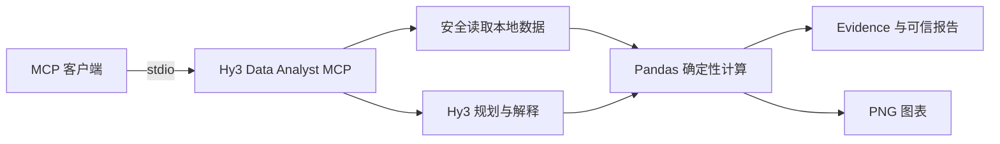

# Hy3 Data Analyst MCP

基于 [Model Context Protocol（MCP）](https://modelcontextprotocol.io/) 和 Hy3 的本地数据分析
Server。它可以在 CodeBuddy、WorkBuddy、Cursor 等支持 MCP 的 AI 客户端中直接使用，读取本地
CSV、JSON、JSONL 数据，通过 Hy3 规划分析并解释结论，再由本地 Pandas 完成确定性计算和
图表渲染。

> [▶ 观看真实客户端调用 Demo](assets/hy3-data-analyst-mcp-demo.mp4)

## 为什么使用它

- **即插即用**：安装后以本地 stdio 模式运行，无需部署公网服务。
- **Hy3 推理**：使用 Hy3 理解自然语言问题、生成受约束的分析计划并解释结果。
- **结果可追溯**：数值由本地白名单操作计算，每项结果带有 Evidence ID 和数据血缘。
- **安全可控**：只读取指定目录，不执行模型生成的 Python、SQL、Shell 或表达式。
- **直接出图**：生成经过字段校验的图表方案，并以 PNG 和 MCP `ImageContent` 返回。

## MCP Tools

Server 提供 4 个公开工具：

| Tool | 功能 | Hy3 API |
| --- | --- | --- |
| `inspect_dataset` | 检查字段、类型、缺失值、重复值、统计信息和样例数据 | 不需要 |
| `analyze_dataset` | 将自然语言问题转换为受约束工作流，执行分析并生成证据化结论 | 需要 |
| `suggest_visualization` | 根据分析目标生成经过校验、可本地执行的图表方案 | 需要 |
| `render_visualization` | 复用图表方案生成 PNG，并返回图片、元数据和 Evidence | 规划新图表时需要 |

支持的数据格式：UTF-8 / UTF-8-SIG 编码的 CSV、JSON 数组和 JSONL；需要时也可显式指定
GB18030 编码。

## 工作方式



Hy3 只负责生成符合 Schema 的计划与说明；文件访问、数据质量处理、统计计算和图片渲染均由
本地受控代码执行。模型不会获得任意代码执行能力。

## 快速开始

### 1. 环境要求

- Python 3.10～3.13
- [uv](https://docs.astral.sh/uv/)
- Hy3 API Key（仅调用 Hy3 相关工具时需要）

### 2. 一键安装

在仓库根目录运行：

```bash
uv tool install --force ./mcp_servers/hy3_data_analyst
```

确认命令已安装：

```bash
hy3-data-analyst-mcp
```

该命令通过 stdio 运行，正常使用时由 MCP 客户端自动启动，无需手动保持终端进程。

### 3. 准备数据与输出目录

`HY3_DATA_DIR` 必须指向一个已存在的数据目录；生成图片时，`HY3_OUTPUT_DIR` 也必须预先
创建并具有写入权限。

仓库自带可直接测试的脱敏数据：

```text
examples/data/sales.csv
```

### 4. 配置 MCP 客户端

项目级通用配置：

```json
{
  "mcpServers": {
    "hy3-data-analyst": {
      "type": "stdio",
      "command": "hy3-data-analyst-mcp",
      "args": [],
      "env": {
        "HY3_API_KEY": "YOUR_HY3_API_KEY",
        "HY3_BASE_URL": "https://tokenhub.tencentmaas.com/v1",
        "HY3_MODEL": "hy3",
        "HY3_DATA_DIR": "ABSOLUTE_PATH_TO_DATA_DIRECTORY",
        "HY3_OUTPUT_DIR": "ABSOLUTE_PATH_TO_EXISTING_OUTPUT_DIRECTORY"
      }
    }
  }
}
```

仓库提供了不含密钥和个人路径的配置模板：

| 客户端 | 项目级配置位置 | 模板 |
| --- | --- | --- |
| CodeBuddy | `.codebuddy/mcp.json` | `examples/codebuddy.mcp.json` |
| WorkBuddy | `workbuddy.mcp.json` | `examples/workbuddy.mcp.json` |
| Cursor | `.cursor/mcp.json` | `examples/cursor.mcp.json` |

替换配置中的占位值后，重启或重新加载客户端。连接成功时应看到以下工具：

```text
inspect_dataset
analyze_dataset
suggest_visualization
render_visualization
```

> 请勿将真实 API Key、个人绝对路径或包含敏感数据的客户端配置提交到 Git。

## 使用示例

将 `HY3_DATA_DIR` 指向示例数据目录后，在 MCP 客户端中输入：

```text
依次调用 inspect_dataset、analyze_dataset、suggest_visualization 和
render_visualization 分析 sales.csv。按 region 计算 profit 与 revenue 的总和及利润率；
渲染时复用 suggest_visualization 返回的 charts，并列出 Evidence ID、结论和 PNG 路径。
不要脱离工具结果自行补数。
```

预期流程：

1. `inspect_dataset` 返回数据结构和质量问题，不需要 API Key。
2. `analyze_dataset` 使用 Hy3 生成受约束计划，由本地 Pandas 计算确定性结果。
3. `suggest_visualization` 返回可执行的 `charts` 和对应 Evidence。
4. `render_visualization` 复用 `charts`，在指定目录生成 PNG 并返回图片内容。

示例数据的区域利润率结果应接近：

| Region | Profit | Revenue | Margin |
| --- | ---: | ---: | ---: |
| East | 1,740 | 3,200 | 54.38% |
| North | 870 | 1,700 | 51.18% |
| South | 800 | 2,150 | 37.21% |
| West | 100 | 4,200 | 2.38% |

## 配置说明

| 环境变量 | 必填 | 默认值 | 说明 |
| --- | --- | --- | --- |
| `HY3_API_KEY` | Hy3 工具必填 | 无 | Hy3 API Key |
| `HY3_BASE_URL` | 否 | `https://tokenhub.tencentmaas.com/v1` | OpenAI 兼容接口地址 |
| `HY3_MODEL` | 否 | `hy3` | 模型名称 |
| `HY3_DATA_DIR` | 是 | 无 | 允许读取的数据目录绝对路径 |
| `HY3_OUTPUT_DIR` | 渲染时必填 | 无 | 已存在的图片输出目录绝对路径 |
| `HY3_TIMEOUT_SECONDS` | 否 | `60` | API 请求超时秒数 |
| `HY3_MAX_RETRIES` | 否 | `2` | 临时错误最大重试次数 |
| `HY3_REASONING_EFFORT` | 否 | `high` | `low` 或 `high` |
| `HY3_MAX_FILE_SIZE_MB` | 否 | `20` | 单个数据文件大小限制 |
| `HY3_MAX_ROWS` | 否 | `100000` | 最大数据行数 |
| `HY3_MAX_COLUMNS` | 否 | `200` | 最大数据列数 |

全部可配置项见 `.env.example`。Server 不会自动加载 `.env`
文件，环境变量应由 MCP 客户端在启动 Server 时传入。

## 安全设计

- 数据文件必须位于 `HY3_DATA_DIR` 内，路径穿越和不受支持的文件格式会被拒绝。
- 文件大小、行数、列数、工作流步骤和 Evidence 数量均有硬限制。
- 分析仅使用预先实现的 Pandas 白名单操作，不调用 `eval()`、`exec()` 或动态 SQL。
- Hy3 生成的计划必须通过 Schema、真实列名和资源限制校验，无效计划最多修复一次。
- 数值结论必须引用本地 Evidence；报告未通过校验时会返回确定性证据和安全的部分结果。
- PNG 只能写入 `HY3_OUTPUT_DIR`，拒绝路径穿越、覆盖、符号链接和重解析点。
- Server 不记录 API Key、Authorization Header、完整请求体或完整原始数据。

## 客户端验证

项目已通过 CodeBuddy 和 Cursor 的本地 stdio MCP 验证，覆盖工具发现、数据检查、Hy3 分析、
图表建议和 PNG 渲染。完整操作过程见页面顶部的
[真实客户端调用 Demo](assets/hy3-data-analyst-mcp-demo.mp4)。

## 本地开发

```bash
cd mcp_servers/hy3_data_analyst
uv sync --all-groups
uv run ruff format --check .
uv run ruff check .
uv run mypy src tests
uv run pytest --cov=hy3_data_analyst_mcp --cov-fail-under=85
uv build
```

## License

本项目遵循仓库根目录 [LICENSE](../../LICENSE) 中的许可协议。
